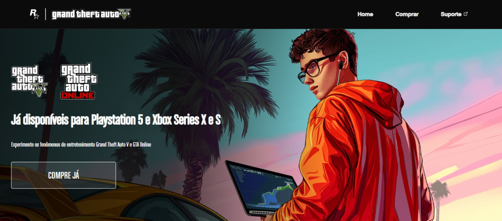

# Projeto GTA

**Descrição:**  
O Projeto GTA é uma landing page temática inspirada no universo de **Grand Theft Auto V / GTA Online**, voltada para exibição visual de plataformas disponíveis, recursos do jogo e chamada para compra. O foco é apresentar um layout moderno, responsivo e envolvente que destaque o estilo do game.

## Índice
* [Visualização](#visualização)
* [Funcionalidades](#funcionalidades)
* [Tecnologias Utilizadas](#tecnologias-utilizadas)
* [Autor](#autor)
* [Licença](#licença)

## Visualização

A página possui:

- Imagens dos jogos (GTA V, GTA Online) e logos das plataformas  
- Seção “Já disponíveis para Playstation 5 e Xbox Series X|S”  
- Botão “Compre já”  
- Seção destacando “Grand Theft Auto V”, mencionando que inclui o modo história + GTA Online, com opções de plataforma  

## Funcionalidades

* Layout responsivo e temas visuais inspirados em GTA  
* Apresentação de plataformas em que o jogo está disponível (PlayStation, Xbox, PC, etc.)  
* Botão de ação (“Compre já”) para chamar o usuário à ação  
* Navegação simples: Home, Comprar, Suporte  

## Tecnologias Utilizadas

#### Front-end:

#### Hospedagem:

## Autor

* Igor de Almeida Verneque — [GitHub](https://github.com/IgorVernequeDev) — igorverneque5@gmail.com  

## Licença

Este projeto está licenciado sob a Licença MIT — veja o arquivo **LICENSE** para mais detalhes.
